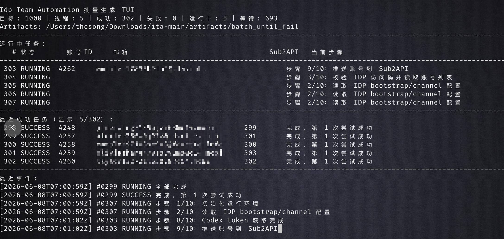

# Idp Team Automation

独立 Python 项目：通过 IDP 生成账号，走纯 HTTP 协议完成 ChatGPT SSO / Codex OAuth，获取 Codex refresh token，并写入 Sub2API 或 CLIProxyAPI（CPA）。

## 项目简介

Idp Team Automation 是一个基于 OpenAI SSO Bug 的 Team 成员账号开通自动化工具。

项目会自动完成 IDP 账号生成、Team 成员账号开通、Codex 授权 URL 生成、refresh token 获取，并将账号录入配置的导出目标。

请作者喝杯咖啡，作者会送你 1000 点 IDP API 点数：[https://pay.ldxp.cn/item/9isxtv](https://pay.ldxp.cn/item/9isxtv)。

## 作者信息

- iDP 协议作者：@该隐
- 注册机作者：@朴圣佑

## 联系方式

| iDP 协议作者 | 注册机作者 |
| --- | --- |
| @该隐 | @朴圣佑 |
|  |  |

## 功能

- 单账号生成、授权、推送 Sub2API / CPA。
- 批量多线程 TUI：
  - 输入账号数量和线程数。
  - 每个任务失败最多重试 5 次；注册账号一旦生成成功，后续重试会复用同一个 IDP account_id，避免重复消耗点数。
  - 运行中显示成功数、失败数、运行中数、等待数。
  - 最终输出统计文本，不在终端打印 token JSON。
- 纯 HTTP 协议流程；无浏览器 fallback。
- 日志和 artifact 默认脱敏。

## 快速使用步骤

1. 复制环境变量模板：

   ```bash
   cp .env.example .env
   ```

2. 编辑 `.env`，填写 IDP 和 Sub2API 配置：

   ```env
   IDP_TOKEN=
   SUB2API_URL=
   SUB2API_EMAIL=
   SUB2API_PASSWORD=
   SUB2API_GROUP=5
   ```

3. 启动 TUI：

   ```bash
   python3 scripts/run_batch_tui.py
   ```

4. 根据 TUI 选择模块：

   ```text
   1. 注册账号
   2. 重新补授权
   ```

## 运行截图



## 安装

```bash
cd <项目目录>
python3 -m pip install -e .
```

如果只直接运行脚本，确保当前 Python 已安装：

```bash
python3 -m pip install 'curl_cffi>=0.7'
```

## 配置

复制示例配置：

```bash
cp .env.example .env
```

填写：

```env
IDP_BASE=http://idp.fdvctte.info
IDP_TOKEN=

SUB2API_URL=
SUB2API_EMAIL=
SUB2API_PASSWORD=
EXPORT_TARGETS=sub2api
```

可选：

```env
IDP_CLIENT_ID=
IDP_CHANNEL_ID=
IDP_DOMAIN=
SUB2API_MODEL_WHITELIST=
CPA_URL=
CPA_MANAGEMENT_KEY=
REQUEST_TIMEOUT=60
```

## 单账号运行

生成新账号并推送默认导出目标（默认 Sub2API）：

```bash
python3 scripts/run_idp_codex.py --timeout 60
```

只推送 CPA：

```bash
python3 scripts/run_idp_codex.py --timeout 60 --export-targets cpa
```

同时推送 Sub2API 和 CPA：

```bash
python3 scripts/run_idp_codex.py --timeout 60 --export-targets sub2api,cpa
```

复用已有 IDP account_id：

```bash
python3 scripts/run_idp_codex.py --account-id 1638 --timeout 60
```

只跑 OAuth，不推送：

```bash
python3 scripts/run_idp_codex.py --timeout 60 --no-sub2api
# 或
python3 scripts/run_idp_codex.py --timeout 60 --export-targets none
```

## 统一 TUI

交互式：

```bash
python3 scripts/run_batch_tui.py
```

进入后先选择模块：

```text
1. 注册账号
2. 重新补授权
```

选择重新补授权时，只需要填写分组 ID、可选指定邮箱和线程数。

注册账号非交互：

```bash
python3 scripts/run_batch_tui.py --mode register --count 10 --threads 3 --yes
```

指定重试次数：

```bash
python3 scripts/run_batch_tui.py --mode register --count 10 --threads 3 --retries 5 --yes
```

只跑 OAuth，不推送：

```bash
python3 scripts/run_batch_tui.py --mode register --count 5 --threads 2 --no-sub2api --yes
# 或
python3 scripts/run_batch_tui.py --mode register --count 5 --threads 2 --export-targets none --yes
```

重新补授权非交互：

```bash
python3 scripts/run_batch_tui.py --mode reauth --group 5 --threads 3 --yes
```

重新补授权只处理前 5 个错误账号：

```bash
python3 scripts/run_batch_tui.py --mode reauth --group 5 --threads 3 --limit 5 --yes
```

重新补授权指定单个邮箱：

```bash
python3 scripts/run_batch_tui.py --mode reauth --group 5 --threads 1 --email user@example.com --yes
```

## Sub2API 分组错误账号检测

检测 `.env` 中 `SUB2API_GROUP` 指定分组内状态错误的账号：

```bash
python3 scripts/check_sub2api_group.py
```

指定分组：

```bash
python3 scripts/check_sub2api_group.py --group 5
```

输出 JSON 并保存：

```bash
python3 scripts/check_sub2api_group.py --group 5 --json --output artifacts/sub2api_group_5_health.json
```

检测错误账号并生成重新授权计划，默认不更新远端：

```bash
python3 scripts/reauthorize_sub2api_errors.py --group 5
```

确认后实际重新授权并更新原 Sub2API 账号，也可以用统一 TUI：

```bash
python3 scripts/reauthorize_sub2api_errors.py --group 5 --apply
python3 scripts/run_batch_tui.py --mode reauth --group 5 --threads 3 --yes
```

重新授权成功后会自动执行：

- 更新原 Sub2API 账号 credentials。
- 清空账号错误状态。
- 清空账号限流状态。
- 打开账号调度。

限制只处理前 3 个错误账号：

```bash
python3 scripts/reauthorize_sub2api_errors.py --group 5 --apply --limit 3
```

只处理指定邮箱：

```bash
python3 scripts/reauthorize_sub2api_errors.py --group 5 --apply --email user@example.com
```

当前检测结果：

```text
SUB2API_GROUP=5
分组账号数：88
错误账号数：23
正常账号数：65
错误状态：error
主要错误：Token revoked (401)
```

## 输出

单账号输出目录：

```text
artifacts/idp_codex/
```

批量输出目录：

```text
artifacts/batch_YYYYMMDD_HHMMSS/
├── summary.json
├── task_0001/
│   ├── attempt_01/
│   └── ...
└── task_0002/
    └── ...
```

`artifacts/` 是运行产物目录，已被 `.gitignore` 忽略；只保留 `artifacts/.gitkeep`。

清理运行产物：

```bash
find artifacts -mindepth 1 ! -name .gitkeep -delete
```

## 测试

```bash
python3 -m pytest -q
```

## 目录

```text
lib/
├── batch_tui.py        # 批量多线程 TUI
├── cli.py              # 单账号 CLI 编排
├── codex_oauth.py      # PKCE / OAuth URL / token 解析
├── config.py           # .env 和 CLI 配置
├── cpa_export.py       # CLIProxyAPI auth 文件导出
├── errors.py           # 项目异常类型
├── idp_client.py       # IDP API
├── logging_utils.py    # 脱敏 JSONL 日志
├── reauthorize_sub2api_errors.py # 错误账号重新授权
├── sub2api_health.py   # Sub2API 分组账号状态检测
├── sso_http_flow.py    # 纯 HTTP SSO/OAuth 主流程
└── sub2api_export.py   # Sub2API 导出

docs/assets/
├── cain_qr.jpg         # @该隐二维码
├── pu_shengyou_qr.jpg  # @朴圣佑二维码
└── tui_running.png     # TUI 运行截图
```
